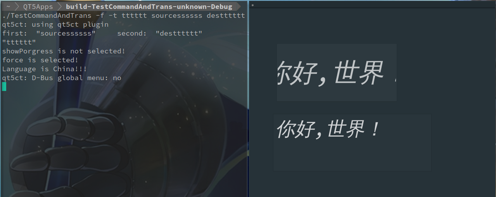
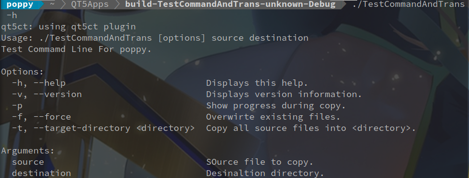

QT读取命令行和国际化初探
===
####读取解析命令行
参考博客：[使用Qt解析命令行参数](https://blog.csdn.net/jcq521045349/article/details/79764090)

使用 **QCommandLineParser** 和 **QCommandLineOption** 这两个类
- QCommandLineParser 
- QCommandLineOption ,创建选项

####国际化
参考博客：[Qt与国际化](https://www.cnblogs.com/hebaichuanyeah/p/5628012.html)

使用 **QTranslator** 和 **QLocate** 这两个类
- QTranslator 加载语言包，供app使用
- QLocate 检测本地语言环境，方便实现自动设置语言

#####示例代码 mainwindow.cpp

```c
#include "mainwindow.h"
#include "ui_mainwindow.h"

MainWindow::MainWindow(QWidget *parent) :
    QMainWindow(parent),
    ui(new Ui::MainWindow)
{
    ui->setupUi(this);
    //使用tr，按钮和文本框文字均默认为hello
    QString test = tr("hello");
    ui->pushButton->setText(test);
    ui->textEdit->setText(test);
}

MainWindow::~MainWindow()
{
    delete ui;
}

void MainWindow::on_pushButton_clicked()
{
    emit changeLanguage();

}
```

#####示例代码 main.cpp

```c
#include "mainwindow.h"
#include <QApplication>
#include <QTranslator>
#include <QDebug>
#include <QCommandLineParser>
#include <QCommandLineOption>

int main(int argc, char *argv[])
{
    QApplication a(argc, argv);
    QApplication::setApplicationName("TestCommandLine");
    QApplication::setApplicationVersion("1.0.0");

    QCommandLineParser parser;
    parser.setApplicationDescription("Test Commamd Line For poppy.");
    parser.addHelpOption();
    parser.addVersionOption();
    parser.addPositionalArgument(
                "source",
                QApplication::translate("main","SOurce file to copy."));
    parser.addPositionalArgument("destination",QApplication::translate("main","Desinaltion directory."));

    // A boolean option with a single name (-p)
    QCommandLineOption showProgressQption("p",QApplication::translate("main","Show progress during copy."));
    parser.addOption(showProgressQption);

    // A boolean option with multiple names (-f, --force)
    QCommandLineOption forceOption(QStringList() << "f" << "force",
                                   QApplication::translate("main","Overwirte existing files.") );
    parser.addOption(forceOption);

    // An option with a value
    QCommandLineOption targetDirectOption(QStringList() << "t" << "target-directory",
                                          QApplication::translate("main","Copy all source files into <directory>."),
                                          QApplication::translate("main","directory"));
    parser.addOption(targetDirectOption);
    parser.process(a);
    const QStringList args = parser.positionalArguments();
    if(args.length() != 2){
        qDebug() << "参数个数不对!";
    }else{
        //获取参数
        qDebug() << "first: " << args.at(0) << "    second: " << args.at(1);
    }

    //确定是否使用参数
    bool showPorgress = parser.isSet(showProgressQption);
    bool force = parser.isSet(forceOption);
    //获取参数
    QString targetDir = parser.value(targetDirectOption);
    qDebug() << targetDir;

    if(showPorgress){
        qDebug() << "showProgress is selected!";
    }else{
        qDebug() << "showPorgress is not selected!";
    }

    if(force){
        qDebug() << "force is selected!";
    }else{
        qDebug() << "force is not selected!";
    }
    //翻译
    QTranslator trans;
    QLocale locale;
    //判断机器语言环境
    if(locale.language() == QLocale::English ){
        qDebug() << "Language is English!!";
    }else if(locale.language() == QLocale::Chinese){
        qDebug() << "Language is China!!!";
    }else{
        qDebug() << "no Language is selected!!";
    }
    //加载语言包
    trans.load(":/translator/zh.qm");
    a.installTranslator(&trans);

    MainWindow w;
    //QObject::connect(&w,SIGNAL(change))
    w.show();

    return a.exec();
}
```
#####运行结果截图


